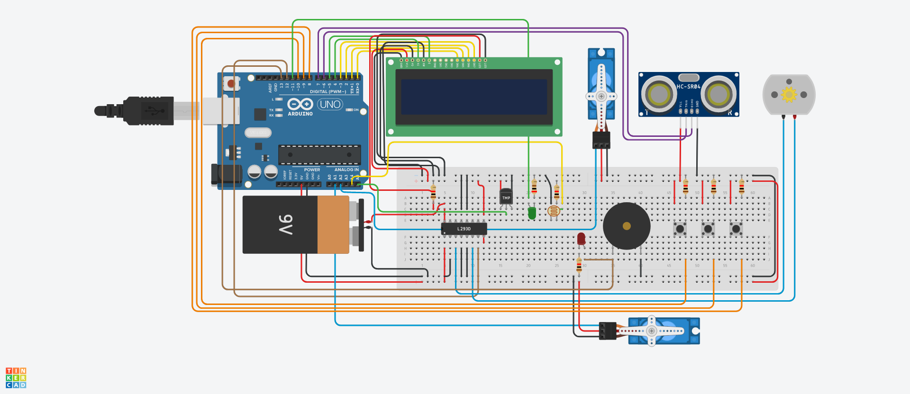

# Final Project:


```#include <LiquidCrystal.h>
#include <Servo.h>

// Defining LCD Object
LiquidCrystal lcd{4, 5, 0, 1, 2, 3};

// Weather & Fan
int motorPin1 = 12;
int tmpPin = A5;
float tmpValue;

// Save Energy
int ledValue, ledPin = 11;
int sensorValue, sensorPin = A4;
float value;
unsigned long res;

// Doors & Pattern
Servo homeDoor;
int homeDoorPin = A1;
const int patternElements = 3;
int buttons[3] = {8, 9, 10};
int pattern[patternElements] = {0, 1, 2};
int pressed[patternElements] = {-1, -1, -1};
int elements = 0;
bool patternIsCorrect = true;
int ledBuzzer = 13;

//int btnValue;

// Garage Door
Servo garageDoor;
int garageDoorPin = A2;
int trigPin = 6, echoPin = 7;
float distance;

// Functions
float getTMP(int pin)
{
  int TMPValue = analogRead(pin);
  float mv = TMPValue / 1023.0;
  mv *= 5;
  mv -= .5;
  mv *= 1000;
  float cl = mv / 10;
  delay(50);
  return cl;
}

void autoLed(int sensorPin, int ledPin)
{
  sensorValue = analogRead(sensorPin);
  value = (sensorValue / 1023.0)*5.0;
  res = (1000 * value) / (5 - value);
  ledValue = map(res, 506, 16950, 0, 255);
  analogWrite(ledPin, ledValue);
}

float getDistance(int trigPin, int echoPin)
{
  float duration, distance;
  digitalWrite(trigPin, LOW);
  delayMicroseconds(5);
  digitalWrite(trigPin, HIGH);
  delayMicroseconds(5);
  digitalWrite(trigPin, LOW);
  duration = pulseIn(echoPin, HIGH);
  distance = duration / 29 / 2;
  delay(50);
  return distance;
}

void setup()
{
  
  lcd.begin(16, 2);
  
  // Weather & Fan
  pinMode(tmpPin, INPUT);
  pinMode(motorPin1, OUTPUT);
  

  // Save Energy
  pinMode(sensorPin, INPUT);
  pinMode(ledPin, OUTPUT) ;
  
  // Doors & Pattern
  pinMode(ledBuzzer, OUTPUT);
  
  for (int i = 0; i < 3; i++)
  {
    pinMode(buttons[i], INPUT);
  }
  
  homeDoor.attach(homeDoorPin); 
  homeDoor.write(0);
  
  // Garage Door
  pinMode (trigPin, OUTPUT);
  pinMode (echoPin, INPUT);
 
  garageDoor.attach(garageDoorPin); 
  garageDoor.write(0);
}

void loop()
{
  lcd.setCursor(0,0);
  
  // Weather & Fan
  tmpValue = getTMP(tmpPin);
  lcd.print("TMP: " + String(tmpValue) + "C");
  
  if (tmpValue > 38)
  {
    digitalWrite(motorPin1,HIGH);
  }
  else
  {
    digitalWrite(motorPin1,LOW); 
  }
  
  // Save Energy
  autoLed(sensorPin, ledPin);
  
  // Doors & Pattern
  lcd.setCursor(0, 1);
  
  if(elements < patternElements)
  {
    if (digitalRead(buttons[0]) == 1)
    {
      pressed[elements] = 0;
      elements++;
      lcd.print("Button Pressed");
      delay(100);
      lcd.clear();
    }
    else if (digitalRead(buttons[1]) == 1)
    {
      pressed[elements] = 1;
      elements++;
      lcd.print("Button Pressed");
      delay(100);
      lcd.clear();
    }    
    else if (digitalRead(buttons[2]) == 1)
    {
      pressed[elements] = 2;
      elements++;
      lcd.print("Button Pressed");
      delay(100);
      lcd.clear();
    }
  }
  else if(elements == patternElements)
  {
    for (int i = 0; i < patternElements; i++)
    {
      patternIsCorrect = patternIsCorrect && pattern[i] == pressed[i];
    }
    
    lcd.setCursor(0, 1);
    
    if (patternIsCorrect == 1)
    {
      lcd.print("Correct !");
      homeDoor.write(180);
      digitalWrite(ledBuzzer, LOW);
    }
    else   
    {
    lcd.print("Incorrect !");
    digitalWrite(ledBuzzer, HIGH);
    }
    
    elements = 0;
    delay(2000);
    homeDoor.write(0);
    lcd.clear();
    patternIsCorrect = true;
    
  }
  
  // Garage Door
  distance = getDistance(trigPin, echoPin);
  if(distance <= 200)
      garageDoor.write(180);
    
  else
    garageDoor.write(0);
}
```